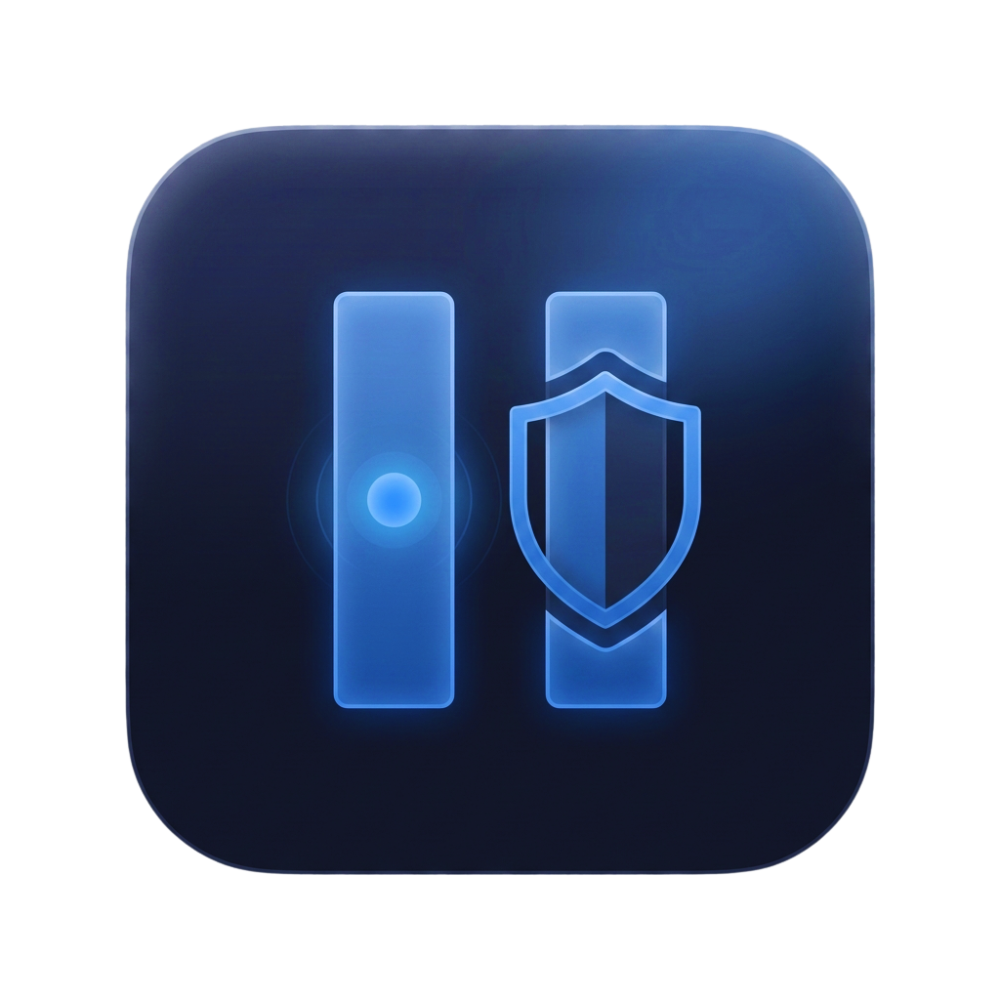
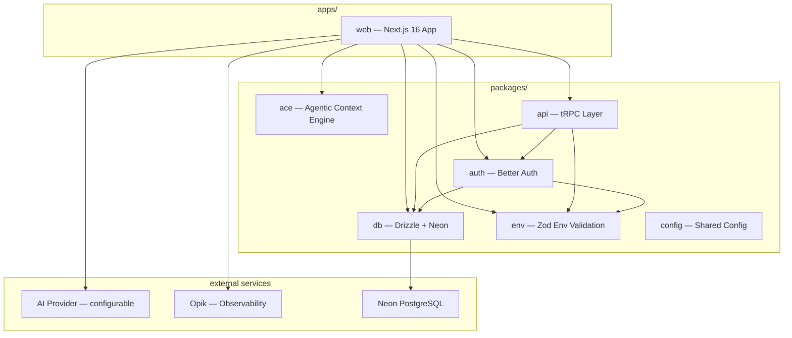

<p align="center">
  
  <br/><br/>
  <a href="LICENSE"></a>
  <a href="https://nextjs.org"></a>
  <a href="https://sdk.vercel.ai"></a>
  <a href="https://www.comet.com/site/products/opik/"></a>
</p>

<h1 align="center">Pause</h1>

<p align="center">
  <strong>AI-powered financial guardian that helps you pause before impulse purchases.</strong>
</p>

The average person makes **multiple impulse purchases every week** — and most regret them within days. Pause intercepts the moment of temptation with a three-tier AI system — analyzing risk, negotiating savings, and prompting reflection — so you make spending decisions you won't regret.

> Built for the **Encode Club Hackathon** — Financial Health & Best Use of Opik categories.

**Deep dives:** [Guardian AI](https://medium.com/@armelhbobdad/deep-dive-how-pause-turns-impulse-spending-into-smarter-decisions-f07b22442970) | [ACE Skillbooks](https://dev.to/armelhbobdad/deep-dive-self-improving-ai-with-ace-skillbooks-2300) | [Opik Observability](https://dev.to/armelhbobdad/deep-dive-building-observable-ai-with-opik-2424)

## Table of Contents

- [Architecture](#architecture)
- [Features](#features)
- [How It Works](#how-it-works)
- [Tech Stack](#tech-stack)
- [Prerequisites](#prerequisites)
- [Quick Start](#quick-start)
- [Environment Variables](#environment-variables)
- [Project Structure](#project-structure)
- [Scripts](#scripts)
- [Deep Dive Articles](#deep-dive-articles)
- [Acknowledgements](#acknowledgements)
- [License](#license)

## Architecture



## Features

### Core Guardian Flow

- **Guardian AI** — Three-tier system (Analyst / Negotiator / Therapist) that adapts responses to purchase risk level
- **Auto-approve** — Low-risk purchases pass through instantly with no friction
- **Coupon Search** — Negotiator tier finds real savings and applies them before you unlock your card
- **Reflection Prompts** — Therapist tier guides you through evidence-based spending reflection techniques
- **Floating Chat** — Always-accessible AI assistant that answers questions about your spending and Pause features, with smart availability based on Guardian state

### Learning & Feedback

- **[ACE Learning](packages/ace/README.md)** — Self-improving Skillbook learns your spending patterns and gets smarter with every interaction
- **Ghost of Spending Past** — Resurfaces past purchases days later so you can reflect on whether they were worth it

### Operations & Observability

- **Dashboard** — Interaction history, savings counter, and learning visualization
- **Opik Observability** — Full trace pipeline with reasoning summaries, strategy predictions, and feedback scores
- **[Demo Mode](DEMO_MODE.md)** — Pre-seeded data and deterministic AI for live demonstrations ([full judges' guide](DEMO_MODE.md))

## How It Works

```text
1. You tap your card to make a purchase
         ↓
2. Pause intercepts and assesses risk (low / medium / high)
         ↓
3. Low risk → Auto-approved instantly
   Medium risk → Negotiator finds coupons & savings
   High risk → Therapist prompts reflection
         ↓
4. You decide: unlock, save, or wait 24 hours
         ↓
5. Days later, Ghost Card asks: "Was it worth it?"
         ↓
6. Your feedback trains the AI — it learns YOUR patterns
```

## Tech Stack

| Layer | Technology |
|-------|-----------|
| Framework | Next.js 16 (App Router, React 19, Turbopack) |
| Runtime | Bun |
| Database | Drizzle ORM + Neon PostgreSQL |
| Auth | Better Auth (email/password) |
| AI | Vercel AI SDK v6 + configurable provider (Google Gemini / Zhipu GLM-4.7-Flash) |
| Learning | ACE (Agentic Context Engine) — vendored fork |
| Observability | Opik + OpenTelemetry |
| UI | Framer Motion, shadcn/ui, Tailwind CSS 4, uitripled components |
| Testing | Vitest + happy-dom + Testing Library |
| Monorepo | Turborepo |

## Prerequisites

- [Node.js](https://nodejs.org/) 20+
- [Bun](https://bun.sh/) 1.x
- [Neon](https://neon.tech/) PostgreSQL account (or local Postgres)
- AI provider API key (Google Gemini or Zhipu GLM-4.7-Flash)

## Quick Start

```bash
# Clone
git clone https://github.com/armelhbobdad/pause.git
cd pause

# Install dependencies
bun install

# Set up environment
cp apps/web/.env.example apps/web/.env.local
# Edit .env.local with your credentials (see Environment Variables below)

# Push database schema
bun run db:push

# Start dev server (Turbopack)
bun dev
```

The app runs at `http://localhost:3001`.

## Environment Variables

| Variable | Required | Description |
|----------|----------|-------------|
| `DATABASE_URL` | Yes | Neon PostgreSQL pooled connection string |
| `DATABASE_URL_DIRECT` | No | Direct (non-pooled) connection for migrations |
| `DATABASE_URL_LOCAL` | No | Local proxy URL (overrides DATABASE_URL in dev) |
| `BETTER_AUTH_SECRET` | Yes | Session encryption secret (32+ characters) |
| `BETTER_AUTH_URL` | Yes | Base URL (`http://localhost:3001` in dev) |
| `AI_MODEL` | No | Model selection in `provider:model` format (default: `google:gemini-3-flash-preview`) |
| `GOOGLE_GENERATIVE_AI_API_KEY` | When using Google | Google AI API key for Gemini |
| `ZHIPU_API_KEY` | When using Zhipu | Z.AI API key for GLM-4.7-Flash |
| `OPIK_API_KEY` | Production only | Opik tracing API key |
| `OPIK_PROJECT_NAME` | No | Opik project name (default: `pause`) |
| `OPIK_WORKSPACE` | No | Opik workspace for team separation |
| `DEMO_MODE` | No | `true` / `false` — enables deterministic AI + mock data |
| `CORS_ORIGIN` | No | Custom CORS origin (falls back to VERCEL_URL) |

## Project Structure

```text
pause/
├── apps/
│   └── web/                 # Next.js 16 application
├── packages/
│   ├── ace/                 # Agentic Context Engine (vendored fork)
│   ├── api/                 # tRPC router + procedures
│   ├── auth/                # Better Auth configuration
│   ├── config/              # Shared TypeScript config
│   ├── db/                  # Drizzle ORM schema + Neon client
│   └── env/                 # Zod-validated environment variables
├── scripts/                 # Seed scripts (seed-rookie, seed-pro)
├── turbo.json               # Turborepo pipeline config
└── package.json             # Workspace root
```

## Scripts

```bash
bun dev              # Start all apps in dev mode
bun build            # Production build
bun run check-types  # TypeScript type checking (all workspaces)
bun run db:push      # Push schema to database
bun run db:studio    # Open Drizzle Studio
bun test             # Run test suite
```

## Deep Dive Articles

Technical deep dives exploring Pause's core systems:

- [**How Pause Turns Impulse Spending Into Smarter Decisions**](https://medium.com/@armelhbobdad/deep-dive-how-pause-turns-impulse-spending-into-smarter-decisions-f07b22442970) — Guardian state machine, tiered AI strategies, and the psychology behind the pause
- [**Self-Improving AI with ACE Skillbooks**](https://dev.to/armelhbobdad/deep-dive-self-improving-ai-with-ace-skillbooks-2300) — How the ACE framework lets the Guardian learn and adapt its strategies over time
- [**Building Observable AI with Opik**](https://dev.to/armelhbobdad/deep-dive-building-observable-ai-with-opik-2424) — End-to-end tracing and observability for AI interactions using Opik + Vercel AI SDK

## Acknowledgements

- [**Encode Club**](https://www.encodeclub.com/programmes/comet-resolution-v2-hackathon) — For launching and organizing this hackathon
- [**Better-T-Stack**](https://www.better-t-stack.dev/) — For the strong project foundation
- [**Neon**](https://neon.com/) — For free-tier PostgreSQL credits
- [**Vercel**](https://vercel.com/) — For free-tier hosting
- [**Zhipu AI**](https://z.ai/) — For free-tier GLM-4.7-Flash API access
- [**Google DeepMind**](https://deepmind.google/) — For free-tier Gemini 3 Flash Preview credits
- [**Opik**](https://www.comet.com/site/products/opik/) — For free-tier observability platform credits
- [**Kayba AI**](https://kayba.ai/) — For the [TypeScript port of the ACE framework](https://github.com/kayba-ai/ace-ts)

## License

[MIT](LICENSE) — Armel BOBDA
