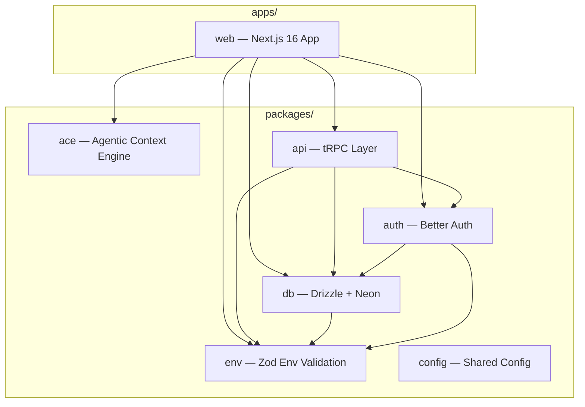

<p align="center">
  
</p>

# Pause

**AI-powered financial guardian that helps you pause before impulse purchases.**

Pause intercepts the moment of temptation with a three-tier AI system — analyzing risk, negotiating savings, and prompting reflection — so you make spending decisions you won't regret.

[](LICENSE)
[](https://nextjs.org)
[](https://sdk.vercel.ai)
[](https://www.comet.com/site/products/opik/)

## Architecture



## Features

- **Guardian AI** — Three-tier system (Analyst / Negotiator / Therapist) that adapts responses to purchase risk level
- **Auto-approve** — Low-risk purchases pass through instantly with no friction
- **Coupon Search** — Negotiator tier finds and applies savings before you unlock
- **Reflection Prompts** — Therapist tier guides you through evidence-based spending reflection
- **[ACE Learning](packages/ace/README.md)** — Self-improving Skillbook learns your patterns and gets smarter over time
- **Ghost Cards** — "Ghost of Spending Past" resurfaces past decisions for delayed satisfaction feedback
- **Dashboard** — Interaction history, savings counter, and learning visualization
- **Opik Observability** — Full trace pipeline with reasoning summaries, strategy predictions, and feedback scores
- **Demo Mode** — Pre-seeded data and deterministic AI for live demonstrations

## Tech Stack

| Layer | Technology |
|-------|-----------|
| Framework | Next.js 16 (App Router, React 19, Turbopack) |
| Runtime | Bun |
| Database | Drizzle ORM + Neon PostgreSQL |
| Auth | Better Auth (email/password) |
| AI | Vercel AI SDK v6 + Google Gemini 2.5 Flash |
| Learning | ACE (Agentic Context Engine) — vendored fork |
| Observability | Opik + OpenTelemetry |
| UI | Framer Motion, shadcn/ui, Tailwind CSS 4, uitripled components |
| Testing | Vitest + happy-dom + Testing Library |
| Monorepo | Turborepo |

## Prerequisites

- [Node.js](https://nodejs.org/) 20+
- [Bun](https://bun.sh/) 1.x
- [Neon](https://neon.tech/) PostgreSQL account (or local Postgres)
- Google AI API key (Gemini)

## Quick Start

```bash
# Clone
git clone <repo-url>
cd pause

# Install dependencies
bun install

# Set up environment
cp apps/web/.env.example apps/web/.env.local
# Edit .env.local with your credentials (see Environment Variables below)

# Push database schema
bun run db:push

# Start dev server (Turbopack)
bun dev
```

The app runs at `http://localhost:3001`.

## Environment Variables

| Variable | Required | Description |
|----------|----------|-------------|
| `DATABASE_URL` | Yes | Neon PostgreSQL pooled connection string |
| `DATABASE_URL_DIRECT` | No | Direct (non-pooled) connection for migrations |
| `DATABASE_URL_LOCAL` | No | Local proxy URL (overrides DATABASE_URL in dev) |
| `BETTER_AUTH_SECRET` | Yes | Session encryption secret (32+ characters) |
| `BETTER_AUTH_URL` | Yes | Base URL (`http://localhost:3001` in dev) |
| `GOOGLE_GENERATIVE_AI_API_KEY` | Yes | Google AI API key for Gemini |
| `OPIK_API_KEY` | Prod | Opik tracing API key |
| `OPIK_PROJECT_NAME` | No | Opik project name (default: `pause`) |
| `OPIK_WORKSPACE` | No | Opik workspace for team separation |
| `DEMO_MODE` | No | `true` / `false` — enables deterministic AI + mock data |
| `CORS_ORIGIN` | No | Custom CORS origin (falls back to VERCEL_URL) |

## Project Structure

```
pause/
├── apps/
│   └── web/                 # Next.js 16 application
├── packages/
│   ├── ace/                 # Agentic Context Engine (vendored fork)
│   ├── api/                 # tRPC router + procedures
│   ├── auth/                # Better Auth configuration
│   ├── config/              # Shared TypeScript config
│   ├── db/                  # Drizzle ORM schema + Neon client
│   └── env/                 # Zod-validated environment variables
├── scripts/                 # Seed scripts (seed-rookie, seed-pro)
├── turbo.json               # Turborepo pipeline config
└── package.json             # Workspace root
```

## Scripts

```bash
bun dev              # Start all apps in dev mode
bun build            # Production build
bun run check-types  # TypeScript type checking (all workspaces)
bun run db:push      # Push schema to database
bun run db:studio    # Open Drizzle Studio
bun test             # Run test suite
```

## Contributing

1. Fork the repository
2. Create a feature branch (`git checkout -b feat/your-feature`)
3. Commit changes following [Conventional Commits](https://www.conventionalcommits.org/)
4. Push and open a pull request

Code quality is enforced by [Biome](https://biomejs.dev/). Run `bun x ultracite fix` before committing.

## License

[MIT](LICENSE) — Armel BOBDA
