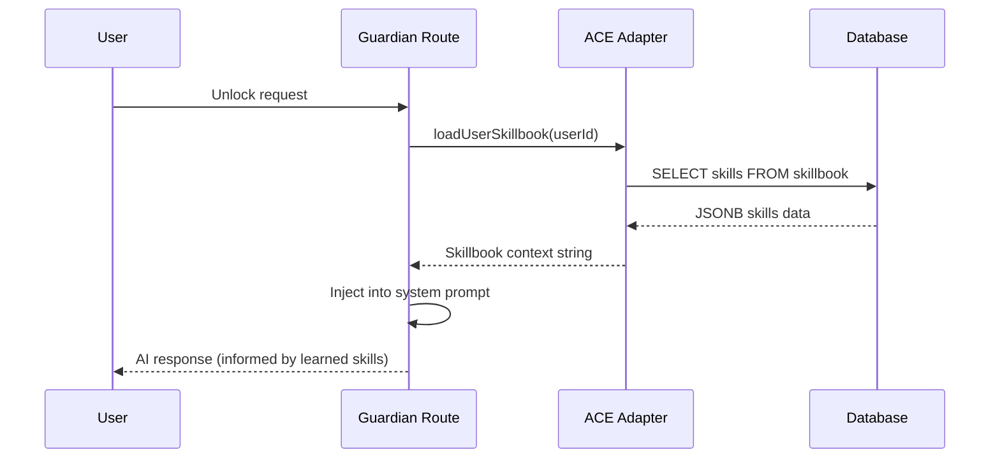
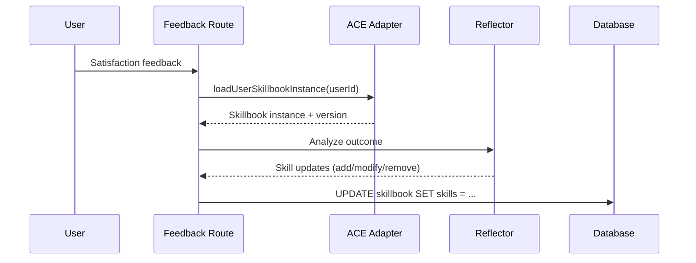

# @pause/ace

**Agentic Context Engine — self-improving AI agents via the Skillbook pattern.**

Vendored fork of [`kayba-ai/ace-ts@f790a4a`](https://github.com/kayba-ai/agentic-context-engine) adapted for the Pause Guardian pipeline.

## Why Vendored

The upstream ACE TypeScript SDK required modifications for Pause's build toolchain:

1. **Turbopack compatibility** — `.js` extensions in TypeScript imports (`from "./foo.js"`) break Turbopack's module resolution. All extensions were stripped.
2. **Python-only imports** — Dynamic `import("sentence-transformers")` calls fail at static analysis. Stubbed with `throw new Error(...)`.
3. **Zod v4 migration** — `z.record()` requires two arguments in Zod v4: `z.record(z.string(), z.any())`.

## Key Concepts

| Concept | Description |
|---------|-------------|
| **Skillbook** | JSON registry of learned skills. Each skill has an ID, description, and effectiveness score. The Skillbook grows as the agent processes more interactions. |
| **SkillManager** | CRUD operations on skills within a Skillbook — add, update, deduplicate, consolidate. |
| **Reflector** | Analyzes interaction outcomes (feedback) and proposes skill updates. Turns user feedback into learning. |
| **Agent** | Executes tasks using Skillbook context. Skills inform the agent's system prompt, making responses improve over time. |

## How It Integrates with Pause

All ACE imports in the app flow through a single adapter module:

```
apps/web/src/lib/server/ace.ts
```

The adapter provides:

- **`loadUserSkillbook(userId)`** — Loads a user's Skillbook from the database (Drizzle/Neon), wraps it as context string for the LLM prompt. Truncates at 8000 chars.
- **`loadUserSkillbookInstance(userId)`** — Returns the raw `Skillbook` instance + version number for mutation operations (feedback pipeline).
- **Re-exports** — `Reflector`, `SkillManager`, `VercelAIClient`, `wrapSkillbookContext` are re-exported for use in route handlers.

### Guardian Pipeline Flow



### Feedback Loop



## Package Exports

```typescript
import { Skillbook, wrapSkillbookContext } from "@pause/ace";
import { VercelAIClient } from "@pause/ace";
import type { Skill, UpdateBatch } from "@pause/ace";
```

**Subpath exports:**

| Path | Content |
|------|---------|
| `@pause/ace` | Core: Skillbook, Agent, Reflector, SkillManager, LLM clients, prompts |
| `@pause/ace/integrations` | Base integration class |
| `@pause/ace/skillbook` | Skillbook class standalone |

## Differences from Upstream

| Area | Upstream (`ace-ts`) | Pause fork (`@pause/ace`) |
|------|-------------------|--------------------------|
| Imports | `.js` extensions | No extensions |
| Python deps | `sentence-transformers` dynamic import | Stubbed (`throw new Error`) |
| Zod | v3 `z.record(z.any())` | v4 `z.record(z.string(), z.any())` |
| TypeScript | Standard | `verbatimModuleSyntax: true` — all type imports use `import type` |
| Linting | None | Biome with targeted overrides for vendored patterns |

## Dependencies

- `ai` (Vercel AI SDK v6) — LLM client abstraction
- `zod` — Schema validation

Optional peer dependencies: `@ai-sdk/google`, `@ai-sdk/openai`, `@ai-sdk/anthropic`
